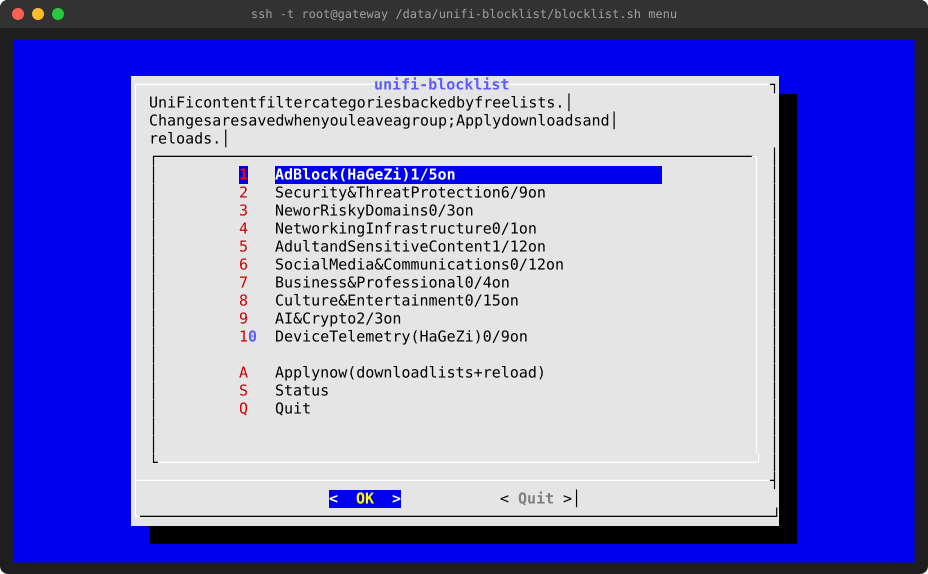
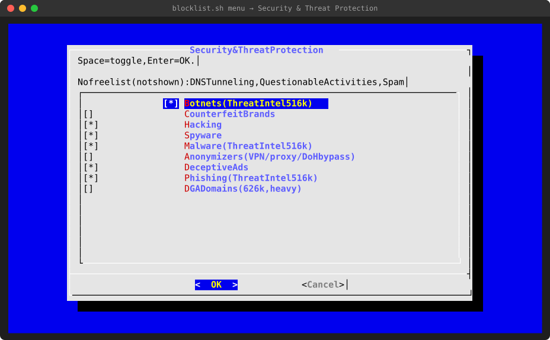

# unifi-blocklist

Category-based DNS filtering for UniFi gateways using free, open-source blocklists instead of the paid **CyberSecure Enhanced** subscription.

On UniFi OS, the detailed content-filter categories (Malware, Phishing, Gambling, Social Networks, …) are greyed out unless you pay for CyberSecure Enhanced. The free built-in **Ad Block** classifies domains one at a time through a cloud lookup and misses a lot. This project fills that gap with community-maintained lists, mainly [HaGeZi](https://github.com/hagezi/dns-blocklists). It loads them into **UniFi's own filtering engine**, so:

- the same category names as the greyed-out UniFi list can be switched on and off from a menu,
- blocked domains still appear in the UniFi web UI,
- the **allow list in the UniFi UI keeps working** and always takes priority,
- no UniFi settings or files are modified, and it can be removed with one command,
- lists refresh automatically every 12 hours.

> [!IMPORTANT]
> This is an unofficial, community project and is not affiliated with or endorsed by Ubiquiti. It relies on undocumented internals of UniFi OS, which can change with any firmware update. It has been **tested on a UniFi Cloud Gateway Ultra only** (details below). Other gateways that use the same engine should work, and the installer checks this before changing anything, but they have not been tested. Use at your own risk.

## Screenshots

Main menu: one entry per UniFi CyberSecure group, with how many categories are switched on.



Inside a group: the same categories as the greyed-out UniFi list. Categories with no free list available are named at the top instead of being shown.



## Compatibility

| | Tested |
|---|---|
| Device | UniFi Cloud Gateway Ultra (UCG Ultra) |
| Firmware | UniFi OS 5.1.33 (`UDRULT.ipq5322.v5.1.33`) |
| UniFi Network | 10.6.106, Content Filter with Ad Block (CyberSecure, no subscription) |
| Filtering engine | UniFi CoreDNS `1.11.3-10+g74ebc1e61302` |

**Probably works** on other UniFi OS 4.x/5.x gateways that have the same content-filter engine, for example UCG Max, UCG Fiber, UDM / UDM Pro / UDM SE, UDR / UDR7 and UXG models. This is untested. Run the built-in check (step 4 below) to find out. It only reads, and the installer refuses to continue if it fails.

**Will not work** on gateways without UniFi OS, such as the USG and older EdgeOS-based models.

If you try it on another model, please open an issue with your model, firmware version and the output of `blocklist.sh check`, whether it works or not.

## Installation

You need a computer on the same network as the gateway and about 10 minutes.

### 1. Enable SSH on the gateway

In UniFi, go to **Settings → Control Plane → Console**, enable **SSH**, and set an SSH password. The menu location can differ slightly between UniFi OS versions; look for "SSH" in the console settings.

### 2. Set up Content Filter in UniFi

In UniFi Network, go to **Settings → CyberSecure → Content Filter**. For each network you want filtered:

| Setting | Value | Why |
|---|---|---|
| **Ad Block** | **On** | **Required.** This is what sends the network's DNS through UniFi's filter, where this project's list is applied. |
| Content filter category (Basic / Work) | Off / None (recommended) | The built-in "Basic" category also blocks many legitimate sites, such as torrent and usenet indexers. Use this project's categories instead (for example `PORNOGRAPHY`). |
| Allow list | sites that must never be blocked | Always takes priority over every block list. |
| Block list | optional | Kept and used alongside this project's lists. |

Networks without Ad Block or a content filter are not filtered at all.

### 3. Connect to the gateway

Open a terminal (macOS/Linux: Terminal; Windows: PowerShell or Windows Terminal) and run the command below. Replace `192.168.1.1` with your gateway's IP address and log in with the SSH password from step 1:

```sh
ssh root@192.168.1.1
```

### 4. Check compatibility (optional, read-only)

```sh
curl -fsSL https://raw.githubusercontent.com/msaifuddin/unifi-blocklist/main/blocklist.sh | bash -s check
```

Every line should say `[ OK ]` and the result should be `compatible`. A `[FAIL]` line explains what's missing. The most common cause is that Ad Block isn't on yet; turn it on, wait a minute and try again.

### 5. Install

```sh
curl -fsSL https://raw.githubusercontent.com/msaifuddin/unifi-blocklist/main/install.sh | bash
```

This installs into `/data/unifi-blocklist` (a location that survives reboots and firmware updates), runs the compatibility check, downloads the default lists and starts the background services. The default categories are **Ad Block Pro, Botnets, Malware and Phishing**, about 650,000 domains.

### 6. Check that it works

On the gateway:

```sh
/data/unifi-blocklist/blocklist.sh status
```

From any computer on a filtered network (works on Windows, macOS and Linux):

```sh
nslookup app-measurement.com 192.168.1.1
```

A blocked domain returns `203.0.113.250` (UniFi's block page address). A normal site such as `github.com` returns its real address.

## Choosing categories

```sh
ssh -t root@192.168.1.1 /data/unifi-blocklist/blocklist.sh menu
```

- Use the arrow keys and Enter to open a group.
- Press Space to switch a category on or off, then Enter to confirm.
- Choose **Apply now** to download the lists and activate them. This takes from a few seconds to a minute, and DNS pauses for a few seconds while the filter reloads.

The same can be done without the menu:

```sh
cd /data/unifi-blocklist
./blocklist.sh categories                         # show all categories and which are on
./blocklist.sh enable gambling social_networks    # switch on (names as shown by 'categories')
./blocklist.sh disable ads_pro                    # switch off
systemctl start unifi-blocklist-update            # download and apply now
```

### Available categories

The groups and names match the CyberSecure Enhanced list in the UniFi UI. Each category is backed by a free list. Where no suitable free list exists, the category is marked **n/a** and can't be switched on.

| Group | Categories with a free list |
|---|---|
| Ad Block (HaGeZi) | Light, Normal, **Pro** (recommended), Pro++, Ultimate. Pick one; each level includes the one before it. |
| Security & Threat Protection | Botnets, Malware, Phishing, Counterfeit Brands, Hacking, Spyware, Anonymizers (VPN/proxy/DoH bypass), Deceptive Ads, DGA Domains |
| New or Risky Domains | Newly Registered Domains (too large for most gateways), Dynamic DNS, Badware Hosters |
| Networking Infrastructure | Redirectors (URL shorteners) |
| Adult and Sensitive Content | Pornography, Nudity, Sexuality, Adult Themes, Gambling, Drugs, Violence, Hate Speech, Weapons, Lingerie, Sex Education, Unreliable Information |
| Social Media & Communications | Social Networks, Chat, Instant Messengers, Messaging, Webmail, Translators, File Sharing, Peer To Peer, Audio/Video Streaming, Radio, File Hosting |
| Business & Professional | News and Media, Magazines, Economy and Finance, Job Search |
| Culture & Entertainment | Shopping, Ecommerce, Auctions, Dating, Gaming, Sports, Movies, Music, Blogs, Forums, Astrology, Religion, Food and Drink, Cartoons and Anime, Comic Books |
| AI & Crypto | Artificial Intelligence, Cryptocurrency, Cryptomining |
| Device Telemetry (HaGeZi) | Apple, Amazon, Samsung, LG webOS, Roku, Windows/Office, Xiaomi, Huawei, TikTok |

The full mapping of categories to lists is in [`categories.list`](categories.list).

**Size matters:** every domain uses gateway memory. As a guide, 200,000 domains use about 15 MB and 650,000 about 80 MB. Large lists include Threat Intelligence (516k), DGA Domains (626k), Gambling (224k) and Newly Registered Domains (3.2M). A safety limit of 1.5 million domains (`MAX_ENTRIES` in `blocklist.conf`) stops an oversized list from being applied; the previous list stays active instead.

## Everyday use

| I want to… | Do this |
|---|---|
| Unblock a site | Add it to the **allow list** in the UniFi UI (Content Filter). It takes effect within about 15 seconds. |
| Block an extra site | Add it to the **block list** in the UniFi UI, or to `/data/unifi-blocklist/custom-block.list` (one domain per line) and run `systemctl start unifi-blocklist-update`. |
| See what's being blocked | UniFi UI, or `tail -f /var/log/ulog/content_filtering.log` on the gateway |
| Check that everything is running | `/data/unifi-blocklist/blocklist.sh status` |
| Update the lists now | `systemctl start unifi-blocklist-update` (otherwise every 12 hours) |
| Update this project | Run the install command from step 5 again. Your settings and categories are kept. |
| Add your own list URLs | Edit `LIST_URLS` in `/data/unifi-blocklist/blocklist.conf` |

Blocked domains appear in the UniFi UI as content-filter blocks.

## Uninstall

```sh
/data/unifi-blocklist/blocklist.sh uninstall   # stops the services and restores UniFi's own block list
rm -rf /data/unifi-blocklist                   # optional: delete all files
```

## Troubleshooting

**A site or app stopped working.** Add its domain to the allow list in the UniFi UI. To find the domain, look at `/var/log/ulog/content_filtering.log` on the gateway while reproducing the problem. If many sites break, choose a lower Ad Block level.

**Nothing is blocked.** Check that Ad Block is on for that network in the UniFi UI, then run `blocklist.sh check` and `blocklist.sh status`. Devices that use their own encrypted DNS (DNS-over-HTTPS in browsers, Android "Private DNS") bypass the gateway entirely. The **Anonymizers** category blocks most of these bypass services.

**After a firmware update.** Run `blocklist.sh status`. If the watcher or timer isn't running, run the install command from step 5 again. If `check` now fails, the firmware has changed how filtering works; please open an issue.

**"Applied: NO" in status.** UniFi has just rewritten its files (for example after a settings change). The watcher re-applies the list within about 15 seconds.

## How it works

UniFi's content filter runs a customised CoreDNS server on the gateway. DNS requests from filtered networks are redirected to it:

```
client ──DNS:53──► firewall rule DNSFILTER (networks in ipset "dnsfilter")
                        │  redirect
                        ▼
                CoreDNS 127.0.0.1:1053   (/run/utm/coredns_config.conf)
                  plugin "hostSet":
                    1. allow list   domainlist_1.list  ← UniFi UI allow list   → resolve normally
                    2. block list   domainlist_0.list  ← UniFi UI block list   → block page
                                                       + this project's lists
                    3. cloud category lookup           ← UniFi Ad Block/Basic  → block
                        │ allowed
                        ▼
                dnsmasq (local DNS records) ──► upstream DNS
```

Facts this project relies on (verified on the UCG Ultra):

- Everything under `/run/utm/` is generated by UniFi from the UI settings. It is rebuilt at boot and whenever content-filter settings are saved.
- `domainlist_0.list` (block) and `domainlist_1.list` (allow) are plain text, one domain per line. An entry also covers its subdomains: `example.com` blocks `www.example.com`.
- The allow list is checked first, so a domain that is on both lists still resolves.
- CoreDNS reads these files only at start-up. UniFi's supervisor (`ubios-udapi-server`) restarts CoreDNS about 1 second after it stops, so restarting it is how a new list is loaded.
- Blocks from this list return `203.0.113.250` / `2001:db8:1000::fa` and are logged with `"category":"INCLUSION"` in `/var/log/ulog/content_filtering.log`, which the UniFi UI reads.

What the script does (`/data/unifi-blocklist/blocklist.sh`):

1. **update** (timer, every 12 hours): downloads the lists for the enabled categories, converts them to plain domains and merges them.
   - Each list is cached. If a download fails, or returns less than half its previous size, the cached copy is used instead.
   - The merged list must fall between `MIN_ENTRIES` and `MAX_ENTRIES` domains, otherwise it isn't applied.
2. **apply**: writes UniFi's own block list entries, then a marker line, then the downloaded list into `domainlist_0.list`, and restarts CoreDNS.
3. **watch** (service): checks every 15 seconds that the marker is still present. If UniFi has rebuilt the file, it re-applies the list.

The background services are systemd units copied into `/etc/systemd/system`. The configuration and lists live in `/data/unifi-blocklist`.

### Files

| Path | Purpose |
|---|---|
| `blocklist.sh` | Main script: menu, check, install, update, apply, watch |
| `install.sh` | Installer and updater (downloads this repository) |
| `categories.list` | Category catalog: UniFi group, category, label, list sources |
| `blocklist.conf` | Your settings: extra list URLs, size limits (created from `blocklist.conf.example`) |
| `categories.enabled` | Your selected categories |
| `custom-block.list` | Optional extra domains to block |
| `state/` | Downloaded lists, merged list, applied checksum |
| `systemd/` | Service and timer definitions |

### Known limitations

- Loading a new list restarts the filter, which pauses DNS for 1–5 seconds, depending on list size. This happens only when the list content changes (at most twice a day) or after UniFi settings are saved.
- The UniFi UI counts these blocks as content-filter blocks, not as "Ad Block".
- UniFi's own cloud lookup still runs for domains not on the list. It can't be turned off without also turning off the redirect this project depends on.
- Not yet tested: behaviour across a firmware update, lists above 1 million domains, and models other than the UCG Ultra.

## Roadmap

- Reload lists without restarting CoreDNS (the engine has a reload command whose input format isn't known yet)
- Free sources for the categories still marked n/a (Spam, Parked Domains, Alcohol, Tobacco, …)
- Optional LAN-only web page for choosing categories

Contributions and test reports from other models are welcome.

## Credits

The blocking data comes entirely from these projects:

- **[HaGeZi DNS Blocklists](https://github.com/hagezi/dns-blocklists)** by HaGeZi: ad and tracker tiers, Threat Intelligence Feeds, gambling, NSFW, social, piracy, anonymizer bypass, URL shorteners and device telemetry lists (GPL-3.0)
- **[HaGeZi NRD](https://github.com/hagezi/nrd)**: newly registered and DGA domains (GPL-3.0), based on data from Stamus Labs
- **[UT1 Blacklists](https://dsi.ut-capitole.fr/blacklists/)** from Université Toulouse Capitole: content categories (CC BY-SA 4.0), downloaded from the [olbat/ut1-blacklists](https://github.com/olbat/ut1-blacklists) mirror
- **[OISD](https://oisd.nl)**: available as an extra list in `blocklist.conf.example`
- **[ghostersk/unifi-adblock](https://github.com/ghostersk/unifi-adblock)**: an earlier project that also used UniFi's `domainlist_0` file

The lists are downloaded directly from their sources by your gateway. They are not redistributed in this repository and remain under their own licenses.

## License

The scripts in this repository are released under the [MIT License](LICENSE). The blocklists are not part of this repository; see Credits for their licenses.
